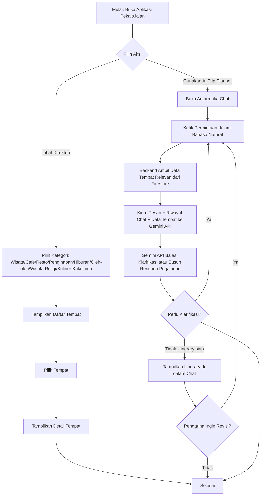
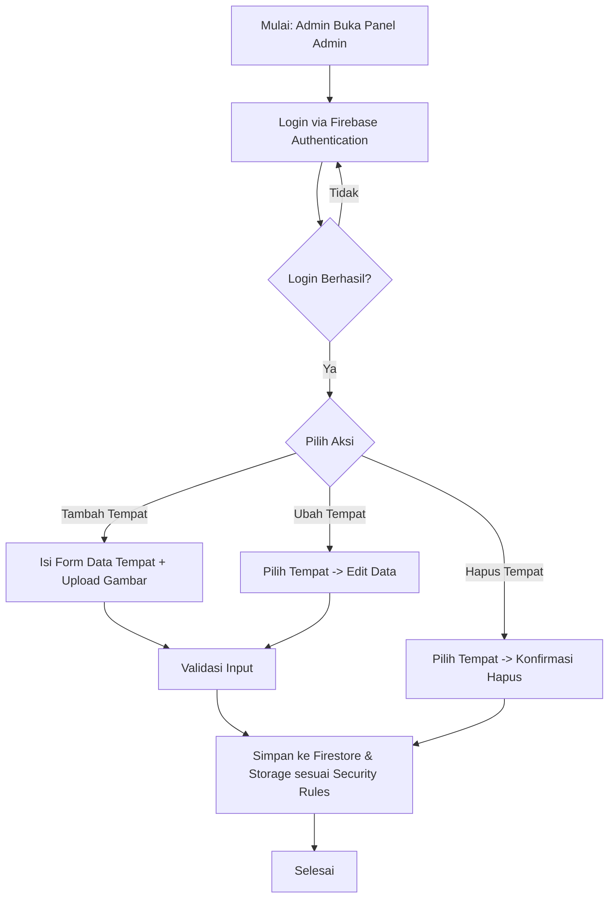
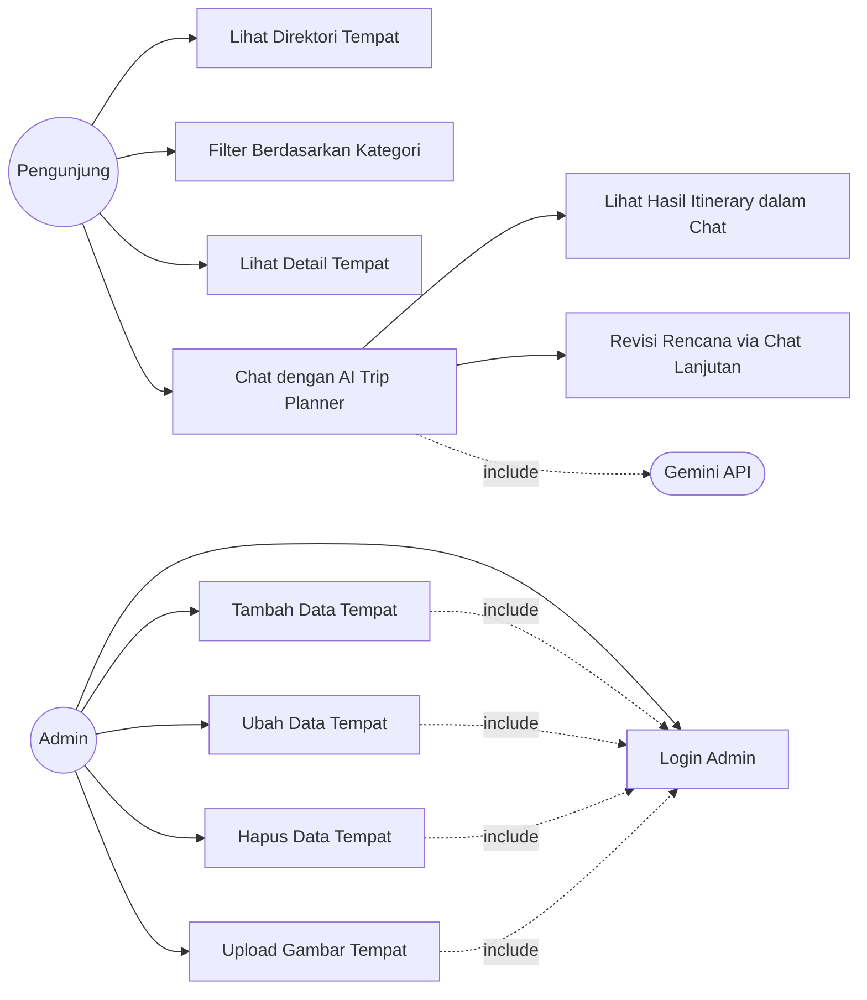
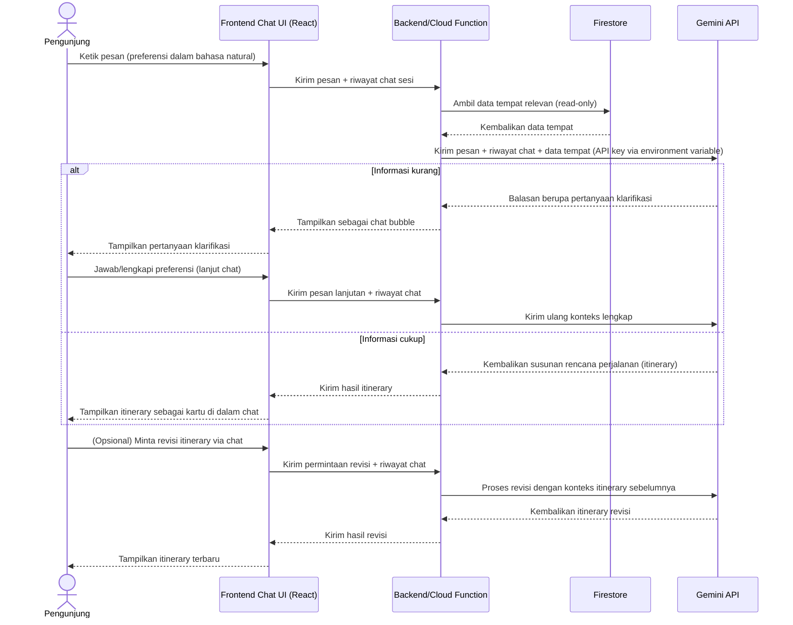
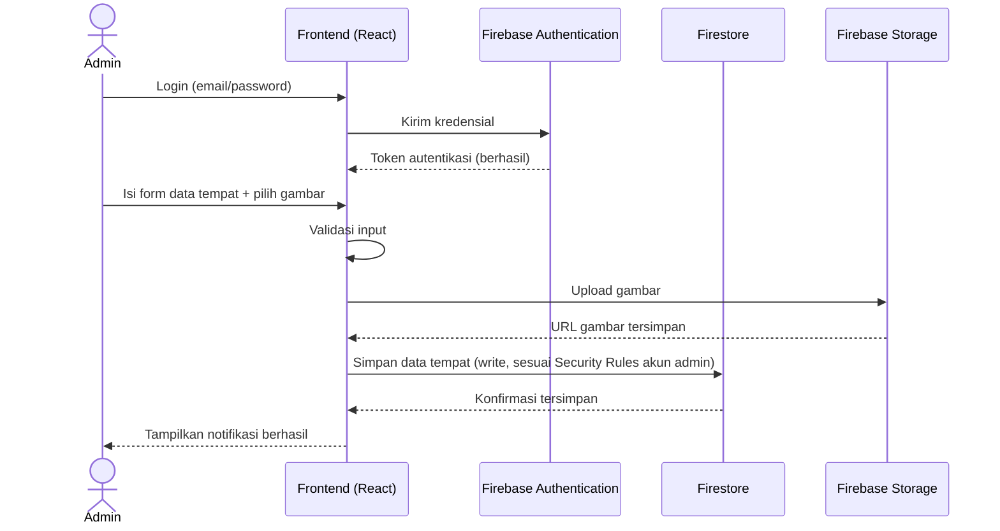

# MASTER PRODUCT BLUEPRINT
## PekaloJalan — Portal Rekomendasi Wisata & AI Trip Planner Kota Pekalongan

> Dokumen ini disusun berdasarkan Proposal Ringkas "PekaloJalan" untuk Lomba Teknologi Piranti Lunak — Jambore Pemuda Kota Pekalongan 2026. Seluruh konten teknis (stack, arsitektur, fitur, keamanan) merujuk langsung pada dokumen proposal yang diberikan. Bagian yang menambahkan detail turunan (use case, sequence diagram, dsb.) ditandai sebagai elaborasi tim, bukan fakta baru dari proposal.

---

## DAFTAR ISI

1. [Project Brief](#1-project-brief)
2. [Product Requirement Document (PRD)](#2-product-requirement-document-prd)
3. [Design Brief](#3-design-brief)
4. [Flowchart](#4-flowchart)
5. [Use Case](#5-use-case)
6. [Sequence Diagram](#6-sequence-diagram)

---

## 1. PROJECT BRIEF

### 1.1 Nama Produk
**PekaloJalan** — Portal Rekomendasi Wisata & AI Trip Planner Kota Pekalongan

### 1.2 Konteks
Disusun untuk Lomba Teknologi Piranti Lunak, rangkaian Jambore Pemuda Kota Pekalongan 2026. Sesuai proposal, jenis dan teknologi aplikasi bebas dipilih peserta; ide ini dipilih sebagai portal rekomendasi wisata dengan fitur AI Trip Planner.

### 1.3 Masalah yang Diselesaikan
Berdasarkan proposal, informasi wisata Kota Pekalongan (wisata budaya batik, kuliner, kafe, hiburan) tersebar di berbagai sumber tidak terkurasi (media sosial pribadi, ulasan Google Maps tidak lengkap, informasi mulut ke mulut), sehingga wisatawan dan warga lokal kesulitan menyusun rencana perjalanan sesuai waktu dan anggaran. Belum ada platform terpadu yang menyediakan rekomendasi sekaligus membantu menyusun rencana perjalanan otomatis.

### 1.4 Solusi
Aplikasi web direktori terkurasi (wisata, cafe, resto, penginapan, hiburan, oleh-oleh/toko batik, wisata religi, kuliner kaki lima/street food) dengan fitur unggulan **AI Trip Planner**: pengguna memasukkan preferensi (kategori, anggaran, durasi), sistem menyusun rencana perjalanan otomatis.

### 1.5 Target Pengguna
- Wisatawan yang berkunjung ke Kota Pekalongan.
- Warga lokal yang mencari rekomendasi tempat.
- (Sisi admin) Pengelola konten yang mengurasi data tempat.

### 1.6 Diferensiator (sesuai proposal)
- Fitur AI Trip Planner sebagai pembeda utama.
- Direktori terpusat lintas kategori dalam satu platform.
- Fokus lokal khas Pekalongan: kategori Oleh-oleh/Batik dan Wisata Religi yang mencerminkan identitas Kota Batik, membedakan dari platform wisata generik nasional.

### 1.7 Stack Teknologi (final, sesuai proposal)
| Komponen | Teknologi |
|---|---|
| Frontend | React JS |
| Backend & Database | Firebase (Firestore, Authentication, Storage) |
| Integrasi AI | Gemini API |
| Hosting | Vercel |

---

## 2. PRODUCT REQUIREMENT DOCUMENT (PRD)

### 2.1 Tujuan Produk
Menyediakan direktori terkurasi tempat wisata/kuliner/penginapan/hiburan Kota Pekalongan dan fitur AI Trip Planner yang menghasilkan rencana perjalanan otomatis berdasarkan preferensi pengguna.

### 2.2 Kategori Data Tempat (sesuai proposal)
1. Wisata
2. Cafe
3. Resto
4. Penginapan
5. Hiburan
6. Oleh-oleh / Toko Batik
7. Wisata Religi
8. Kuliner Kaki Lima / Street Food

### 2.3 Daftar Fitur

#### A. Fitur Publik (Pengunjung — tanpa login)
| ID | Fitur | Deskripsi |
|---|---|---|
| F1 | Direktori Tempat | Menampilkan daftar tempat per kategori dengan info dasar (nama, kategori, deskripsi, lokasi, gambar) |
| F2 | Filter/Pencarian Kategori | Menyaring tempat berdasarkan kategori |
| F3 | Detail Tempat | Halaman detail satu tempat |
| F4 | **AI Trip Planner (berbasis chat)** | Antarmuka chat conversational (seperti LLM) — pengguna mengetik preferensi/permintaan dalam bahasa natural, dapat multi-turn (revisi/klarifikasi), sistem menghasilkan rencana kunjungan (itinerary) |
| F5 | Tampilan Itinerary dalam Chat | Menampilkan hasil AI Trip Planner sebagai kartu/linimasa terstruktur di dalam alur chat |
| F6 | Tampilan Responsif | Tampilan menyesuaikan desktop, tablet, dan smartphone (mobile-first) |

#### B. Fitur Admin (Pengelola — perlu login)
| ID | Fitur | Deskripsi |
|---|---|---|
| F7 | Login Admin | Autentikasi via Firebase Authentication |
| F8 | Kelola Data Tempat | Tambah/ubah/hapus data tempat (khusus akun admin terautentikasi) |
| F9 | Kelola Gambar | Upload gambar tempat ke Firebase Storage |

### 2.4 Alur Kerja Fitur AI Trip Planner (berbasis chat — diperbarui atas permintaan Anda)

> Catatan: Proposal asli mendeskripsikan AI Trip Planner berbasis **form** (input kategori, budget, durasi). Atas instruksi Anda, alur ini diperbarui menjadi **antarmuka chat/conversational (seperti LLM)**. Ini adalah keputusan desain baru dari Anda, bukan isi proposal asli — dicatat di sini agar konsisten di seluruh dokumen.

1. Pengguna membuka antarmuka chat AI Trip Planner (mirip chatbot LLM), bukan form statis.
2. Pengguna mengetik permintaan dalam bahasa natural (mis. "Saya mau jalan-jalan 1 hari di Pekalongan, budget 200rb, suka kuliner dan wisata religi").
3. Frontend mengirim pesan pengguna (beserta riwayat percakapan untuk menjaga konteks multi-turn) ke backend.
4. Backend mengambil data tempat relevan dari Firestore (berdasarkan kategori/kata kunci yang terdeteksi dari pesan, atau seluruh data tempat jika diperlukan sebagai konteks).
5. Backend mengirim pesan pengguna + riwayat chat + data tempat ke Gemini API sebagai konteks (system prompt mengarahkan Gemini untuk berperan sebagai trip planner Kota Pekalongan).
6. Gemini API merespons secara percakapan: bisa berupa balasan teks biasa (klarifikasi, tanya balik jika informasi kurang) atau hasil rencana perjalanan terstruktur (itinerary).
7. Frontend menampilkan balasan dalam bentuk chat bubble; jika responsnya berupa itinerary, ditampilkan juga sebagai kartu/linimasa terstruktur di dalam chat.
8. Pengguna dapat melanjutkan percakapan untuk merevisi rencana (mis. "ganti resto B dengan yang lebih murah") tanpa mengisi ulang form.

### 2.5 Kebutuhan Non-Fungsional

#### Keamanan Data (sesuai proposal)
- **Firebase Security Rules**: pengunjung hanya *read-only* pada Firestore; operasi tambah/ubah/hapus dibatasi untuk akun admin terautentikasi.
- **Firebase Authentication**: mengamankan akses panel admin.
- **Perlindungan API Key**: kunci Gemini API dan konfigurasi sensitif Firebase disimpan via *environment variables*, tidak *hardcoded*.
- **HTTPS**: seluruh komunikasi client–Firebase–Gemini API terenkripsi.
- **Validasi Input**: divalidasi di sisi frontend maupun backend/rules untuk mencegah data tidak valid/injection.

#### Kompatibilitas
- Desain responsif *mobile-first* dengan React, menyesuaikan desktop, tablet, smartphone.

### 2.6 Kriteria Keberhasilan (selaras kriteria penilaian lomba)
- Fungsi direktori dan AI Trip Planner berjalan andal.
- Desain UI jelas dan mudah dipahami.
- Mekanisme keamanan data diterapkan sesuai poin 2.5.
- Dokumentasi tersedia (panduan penggunaan).
- Tampilan berfungsi baik lintas perangkat.

### 2.7 Di Luar Cakupan (Out of Scope)
*(Elaborasi tim — tidak disebutkan eksplisit di proposal, ditambahkan sebagai batasan wajar untuk pengembangan MVP lomba)*
- Sistem pemesanan/transaksi (booking, pembayaran).
- Ulasan/rating pengguna.
- Aplikasi mobile native (hanya web responsif).

---

## 3. DESIGN BRIEF

### 3.1 Prinsip Desain
- **Mobile-first**: sesuai proposal, prioritas tampilan smartphone karena wisatawan mengakses saat bepergian.
- **Identitas lokal**: nuansa visual mencerminkan Kota Pekalongan sebagai Kota Batik (elaborasi tim — dapat memakai motif batik sebagai aksen visual, bukan konten utama).
- **Kejelasan informasi**: struktur direktori dan hasil itinerary harus mudah dipindai (scannable).

### 3.2 Komponen Antarmuka Utama
*(Elaborasi tim berdasarkan fitur di PRD)*
| Halaman/Komponen | Isi |
|---|---|
| Landing/Beranda | Hero singkat, akses cepat ke kategori dan ke AI Trip Planner |
| Direktori per Kategori | Grid/list kartu tempat: gambar, nama, kategori, ringkasan lokasi |
| Detail Tempat | Gambar, deskripsi, kategori, lokasi |
| Chat AI Trip Planner | Antarmuka chat (bubble percakapan, input teks bebas, riwayat pesan tersimpan selama sesi) mirip chatbot LLM, bukan form |
| Hasil Itinerary (dalam Chat) | Kartu itinerary terstruktur (tempat A → B → C dengan waktu/urutan) muncul inline di dalam alur chat |
| Panel Admin | Login, form tambah/ubah/hapus tempat, upload gambar |

### 3.3 Tone Visual
*(Elaborasi tim — perlu difinalisasi tim desain sebelum implementasi)*
- Warna dasar cerah namun tetap profesional, dapat mengambil inspirasi warna batik khas Pekalongan (mis. cokelat tanah, biru indigo, krem) sebagai aksen — bukan warna literal dari proposal karena proposal tidak menetapkan palet warna spesifik.
- Tipografi sederhana dan mudah dibaca di layar kecil.

### 3.4 Aset yang Perlu Disiapkan (sesuai ketentuan lomba)
- Sketsa UI, logo, palet warna, tata letak — sesuai dokumen kelengkapan teknis yang diwajibkan panitia lomba.

---

## 4. FLOWCHART

### 4.1 Flowchart Alur Pengguna Umum (Pengunjung)

### 4.2 Flowchart Alur Admin

---

## 5. USE CASE

### 5.1 Daftar Aktor
- **Pengunjung** (wisatawan/warga lokal, tanpa login)
- **Admin** (pengelola konten, login via Firebase Authentication)
- **Sistem AI (Gemini API)** — aktor eksternal yang berinteraksi via integrasi

### 5.2 Diagram Use Case (Mermaid)

### 5.3 Rincian Use Case Utama

#### UC4 — Chat dengan AI Trip Planner
- **Aktor**: Pengunjung
- **Prekondisi**: Aplikasi terbuka, data tempat tersedia di Firestore.
- **Alur Utama**:
  1. Pengunjung membuka antarmuka chat AI Trip Planner.
  2. Pengunjung mengetik permintaan dalam bahasa natural (kategori, budget, durasi, preferensi lain disebutkan bebas dalam kalimat).
  3. Sistem mengirim pesan + riwayat chat ke backend, backend mengambil data tempat relevan dari Firestore.
  4. Sistem mengirim pesan pengguna + riwayat chat + data tempat ke Gemini API.
  5. Gemini API merespons: jika informasi kurang, mengajukan pertanyaan klarifikasi (kembali ke langkah 2); jika cukup, mengembalikan rencana perjalanan.
  6. Sistem menampilkan hasil sebagai itinerary di dalam alur chat.
- **Alur Alternatif**: Pengunjung dapat mengirim pesan lanjutan untuk merevisi itinerary (mis. mengganti satu tempat), tanpa mengulang dari awal.
- **Postkondisi**: Pengunjung memperoleh rencana perjalanan terstruktur melalui percakapan.

#### UC7 — Tambah Data Tempat
- **Aktor**: Admin
- **Prekondisi**: Admin sudah login (terautentikasi).
- **Alur Utama**:
  1. Admin membuka form tambah tempat.
  2. Admin mengisi data (nama, kategori, deskripsi, lokasi) dan mengunggah gambar.
  3. Sistem memvalidasi input di sisi frontend dan backend/rules.
  4. Sistem menyimpan data ke Firestore dan gambar ke Storage sesuai Firebase Security Rules (hanya admin terautentikasi yang boleh menulis).
- **Alur Alternatif**: Jika validasi gagal, sistem menampilkan pesan error.
- **Postkondisi**: Data tempat baru tersimpan dan tampil di direktori publik.

---

## 6. SEQUENCE DIAGRAM

### 6.1 Sequence Diagram — AI Trip Planner (berbasis Chat)

### 6.2 Sequence Diagram — Admin Kelola Data Tempat

---

